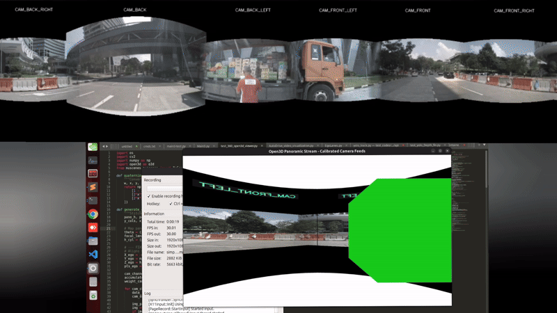

# NuScenes 3D Surround View Visualization

A lightweight and educational implementation of a 360° surround-view visualization using the NuScenes API.

---

## Demo



---

## Requirements

- Python 3.10+
- NumPy
- OpenCV
- Matplotlib
- PyQuaternion
- NuScenes Devkit

NuScenes Resources:

- Official Website: https://www.nuscenes.org/
- Dataset Download: https://www.nuscenes.org/download
- NuScenes Devkit: https://github.com/nutonomy/nuscenes-devkit

Install the NuScenes SDK:

```bash
pip install nuscenes-devkit
```

---

## Overview

This project demonstrates how to:

- Load multi-camera data from NuScenes
- Visualize camera positions and orientations
- Transform sensor data into a common vehicle coordinate frame
- Create a simple 360° surround-view representation
- Visualize annotated 3D bounding boxes

---

## Run

```bash
python test_360_surround_open3d_viewer.py
```

---

## Output

- 360° surround-view visualization
- Top-down (BEV) representation
- Camera pose visualization
- 3D bounding box rendering

---

## Repository Structure

```text
nuscenes-surround-view/
├── README.md
├── test_360_surround_open3d_viewer.py
└── assets/
    └── demo.gif
```

---

## License

This project is intended for educational and research purposes.
